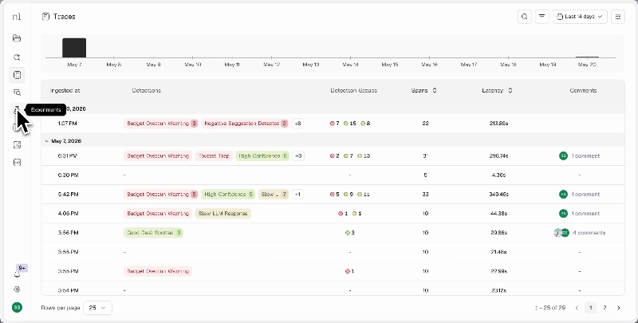
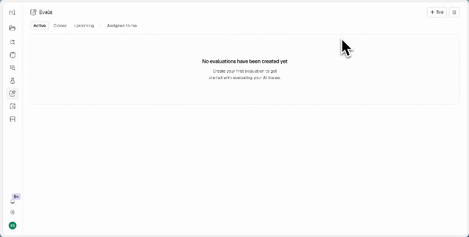

<div align="center">

<h1>neatlogs</h1>

<p>LLM observability for AI agents.<br/>Instrument once. Inspect everything.</p>

<p>
  <a href="https://badge.fury.io/py/neatlogs"></a>
  
  
</p>

<p>
  <a href="https://neatlogs.com">Website</a> &nbsp;·&nbsp;
  <a href="https://docs.neatlogs.com">Docs</a> &nbsp;·&nbsp;
  <a href="https://neatlogs.com">Get API key</a>
</p>

<br/>

<p><i>Agent failures don't throw exceptions — they produce wrong outputs, miss tool calls, or hallucinate.<br/>Neatlogs captures every trace so you can see exactly what the model was given, what it decided, and what each step returned.</i></p>

</div>

---


## Quick Setup

### Step 1: Sign up and get your API key

Go to [neatlogs.com](https://neatlogs.com/?utm_source=neatlogs-docs), create a project, and copy the API key from your dashboard.


### Step 2: Install the SDK

```bash
pip install neatlogs
```

### Step 3: Add this before your code runs

Call `neatlogs.init()` before importing any instrumented libraries so the auto-instrumentation patches land first.

```python
import os
import neatlogs

neatlogs.init(
    api_key=os.environ["NEATLOGS_API_KEY"],
    endpoint=os.environ["NEATLOGS_ENDPOINT"],
    workflow_name="my-agent",
    instrumentations=["openai", "langchain", "crewai"],
)

# Now import and run your code as normal
from crewai import Crew, Agent, Task
```

That's it — no changes to the rest of your code.

### Step 4: Traces logged directly in your dashboard

Every tool call, agent run, and LLM call is captured and surfaced in your Neatlogs dashboard automatically. Tag teammates and leave comments directly on any trace step — no context switching, no Slack threads, no copy-pasting outputs.


### Step 5: Experiments — version control for your prompts

Iterate on prompts without touching production. Neatlogs gives you version control for every prompt in your crew and a playground to test changes side by side — so you can improve agent behaviour safely before it goes anywhere near your live system.



### Step 6: Code fixes directly in your IDE

Get agent improvement suggestions and code fixes surfaced straight into Cursor, Codex, Claude Code, and other AI-native editors. Debug and improve your crew without leaving the tools you already work in.


### Step 7: Human evaluations

Bring your team in to review agent outputs, mark runs as correct or incorrect, and build evaluation datasets straight from production traces. Close the loop between what your agents produce and what they should produce.



---

## Core features

- **[Traces](https://docs.neatlogs.com/features/traces)**: Every agent run is captured as a full span tree — LLM calls, tool invocations, retrievals, reranking, and guardrail checks — with inputs, outputs, token counts, cost, and latency. When something goes wrong, the trace shows you exactly what the model was given, what it decided, and what each step returned.

- **[Timeline view](https://docs.neatlogs.com/features/traces#timeline)**: Maps every span onto a time axis so you can see which steps ran in parallel, where latency concentrated, and where the process was simply idle. Gaps between bars are real — a network call, a lock, an async scheduler doing nothing useful.

- **[AI assistant](https://docs.neatlogs.com/features/traces#ai-assistant)**: Each trace has a built-in assistant with full read access to the run. Ask it why the agent didn't call a tool, what context the model was given, or which step dominated wall-clock time — answers are grounded in the actual span data, not a generic product description.

- **[AI Search](https://docs.neatlogs.com/features/ai-search)**: Query across all your traces in plain English without building filters or writing SQL. Fast mode returns results immediately; Pro mode reasons across the data for deeper analysis.

- **[Detections](https://docs.neatlogs.com/features/detections)**: Define rules that automatically flag matching spans — regex patterns, numeric conditions, PII presence, or model-based classifiers. Flagged traces surface as badges in the dashboard so regressions don't stay hidden in a list of green runs.

- **[Prompt management](https://docs.neatlogs.com/features/experiments)**: Version-control your prompts, promote versions to production with a label change, and test in the built-in Playground before shipping. No redeployment needed to roll back a bad prompt.

- **[Comments & voting](https://docs.neatlogs.com/features/comments)**: Pin notes to any span, @mention teammates, and vote outputs up or down. Votes are stored at the span level and filterable across your workflow — a lightweight way to build labelled eval sets as you debug production traces.

---

## Supported libraries

Pass any combination of these keys to `instrumentations` in `neatlogs.init()`. Call `neatlogs.init()` before importing any instrumented library.

### LLM providers

| Provider | Key | Install |
|---|---|---|
| OpenAI | `openai` | `pip install "neatlogs[openai]"` |
| Anthropic | `anthropic` | `pip install "neatlogs[anthropic]"` |
| Google Gemini | `google_genai` | `pip install "neatlogs[google-genai]"` |
| Azure OpenAI | `azure_ai_inference` | `pip install "neatlogs[azure-ai-inference]"` |
| AWS Bedrock | `bedrock` | `pip install "neatlogs[bedrock]"` |
| LiteLLM | `litellm` | `pip install "neatlogs[litellm]"` |

### Agent frameworks

| Framework | Key | Install |
|---|---|---|
| LangChain | `langchain` | `pip install "neatlogs[langchain]"` |
| LangGraph | `langgraph` | `pip install "neatlogs[langgraph]"` |
| CrewAI | `crewai` | `pip install "neatlogs[crewai]"` |

### Vector stores

| Store | Key | Notes |
|---|---|---|
| ChromaDB | `chromadb` | Auto-instrumented when installed |
| Pinecone | `pinecone` | Auto-instrumented when installed |
| Qdrant | `qdrant` | Auto-instrumented when installed |
| Weaviate | `weaviate` | Auto-instrumented when installed |
| Milvus | `milvus` | `pip install "neatlogs[milvus]"` |
| Redis | `redis` | Auto-instrumented when installed |
| OpenSearch | `opensearch` | Auto-instrumented when installed |
| Elasticsearch | `elasticsearch` | Auto-instrumented when installed |
| Marqo | `marqo` | Auto-instrumented when installed |

---

## Manual spans

Use `@neatlogs.span` to instrument your own agents, tools, and orchestration logic:

```python
@neatlogs.span(kind="WORKFLOW")
def handle_request(user_input: str) -> str:
    ...

@neatlogs.span(kind="TOOL", tool_name="web-search")
def search(query: str) -> list:
    ...
```

Available kinds: `WORKFLOW` · `AGENT` · `CHAIN` · `TOOL` · `RETRIEVER` · `RERANKER` · `EMBEDDING` · `GUARDRAIL` · `MCP_TOOL` · `VECTOR_STORE`

---

## License

MIT
